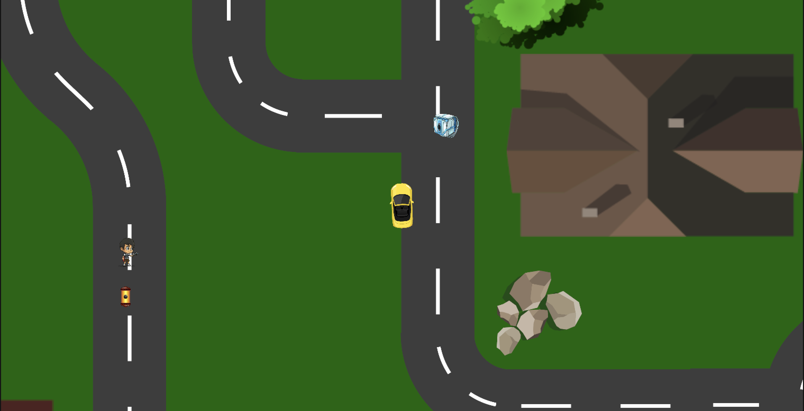

# 🚗 Delivery Driver - Unity 2D

A 2D game built in Unity where players navigate a car to pick up and deliver packages to specific recipients. The game features engaging mechanics such as speed boosts and obstacles, creating an exciting gameplay experience.

Link: [https://anshusinha26.github.io/Delivery-Driver](https://anshusinha26.github.io/Delivery-Driver)

---

## 📸 Screenshots

---

## ✨ Features

- Package Pickup and Delivery: Players collect packages and deliver them to designated locations.
- Speed Boost Mechanic: Allows temporary speed boosts for faster delivery.
- Bump Obstacles: Adds challenge by introducing terrain or objects that slow down the car.
- Smooth Controls: Optimized driving mechanics for seamless gameplay.

---

## ⚙️ Tech Stack

- Unity: Game engine for building 2D environments and mechanics.
- C#: Primary programming language for scripting game logic.
